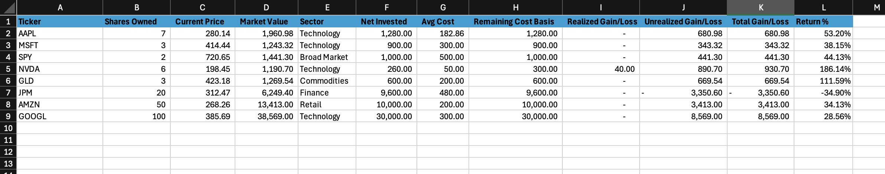
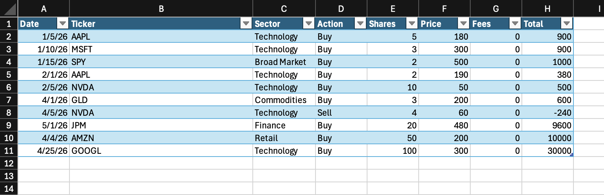
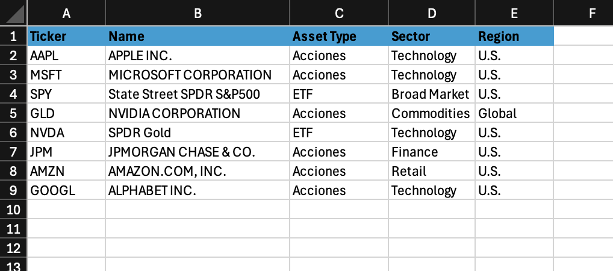
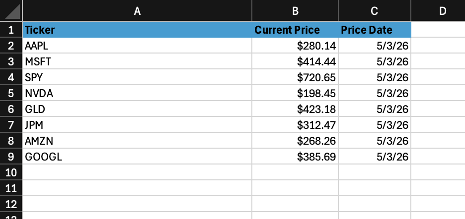
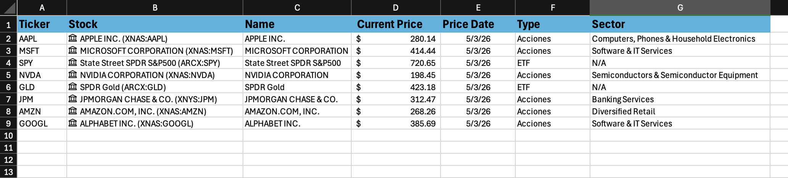
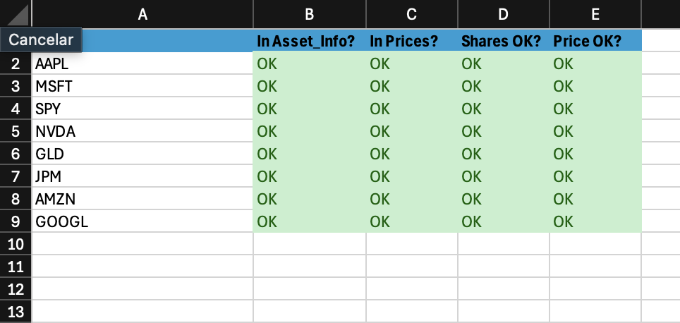
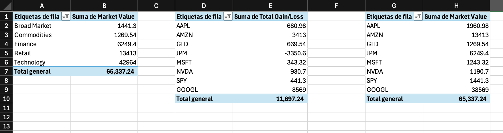

# Financial Dashboard

An Excel-based portfolio dashboard for tracking holdings, market value, realized and unrealized gain/loss, return percentage, and allocation by sector or ticker.

## Overview

This workbook organizes portfolio activity into transaction, price, holding, validation, and summary tabs. The dashboard tab turns those inputs into key portfolio metrics and charts for quick review.

## Workbook Features

- Tracks buy and sell transactions by ticker.
- Maintains asset information such as company, sector, and asset class.
- Stores current prices used for portfolio valuation.
- Calculates holdings, market value, gains/losses, and return percentage.
- Includes validation checks to help confirm workbook integrity.
- Summarizes portfolio allocation and performance in a dashboard view.

## Workbook Structure

| Sheet | Purpose |
| --- | --- |
| `Transactions` | Records portfolio transactions. |
| `Asset_Info` | Stores ticker metadata and classification fields. |
| `Prices` | Stores current market prices. |
| `Stock_Data` | Combines stock metadata and price information. |
| `Holdings` | Calculates current holdings and portfolio value by ticker. |
| `Checks` | Reconciles key workbook calculations. |
| `Pivot_Summary` | Summarizes holdings for reporting. |
| `Dashboard` | Presents headline metrics and charts. |

## Files

- [Financial Dashboard.xlsx](workbook/Financial%20Dashboard.xlsx) - Excel workbook.
- [assets/screenshots](assets/screenshots) - Workbook screenshots used in this README and project page.
- [index.html](index.html) - Static project showcase page.
- [styles.css](styles.css) - Styling for the project page.

## Screenshots

### Dashboard

### Holdings

### Transactions

### Supporting Sheets

## Notes

The dashboard currently reflects workbook values as of May 3, 2026.
