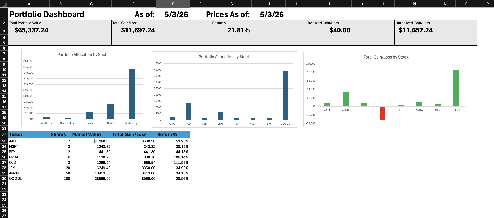

# Financial Dashboard



## Overview

Financial Dashboard is an Excel-based portfolio analysis workbook that tracks investments from raw transaction activity through to a finished performance dashboard. It records trades, stores asset and price data, calculates current holdings, checks the accuracy of the model, and summarizes portfolio performance with charts and key metrics.

The project also includes a simple static web page that presents the workbook, explains its purpose, and displays screenshots of the finished dashboard and supporting sheets.

## Why This Project Exists

Investment tracking can become difficult when transaction history, current prices, asset classifications, and performance calculations are stored in separate places. Without a structured model, it is easy to lose track of cost basis, realized gains, unrealized gains, sector exposure, and whether the numbers reconcile correctly.

This project solves that problem by organizing the full portfolio workflow inside one workbook. The purpose is to turn scattered investment data into a clear, reviewable dashboard that helps a user understand portfolio value, performance, allocation, and data quality at a glance.

## How It Works

1. Transaction activity is entered in the `Transactions` sheet.

   This sheet captures the investment activity that drives the model, including tickers, transaction type, share quantity, price, and dates.

2. Asset details are stored in `Asset_Info`.

   Each ticker is connected to descriptive information such as company name, sector, and asset type. This makes it possible to summarize the portfolio by category instead of only by ticker.

3. Current prices are maintained in `Prices`.

   The workbook uses current market prices to calculate the present value of each holding.

4. `Stock_Data` combines lookup information.

   This sheet brings together asset metadata and price data so downstream calculations can reference a cleaner, more complete stock dataset.

5. `Holdings` calculates portfolio position values.

   The workbook aggregates transactions by ticker, calculates current share counts, market value, cost basis, realized gain/loss, unrealized gain/loss, total gain/loss, and return percentage.

6. `Checks` validates the model.

   Reconciliation checks help confirm that key calculations tie together correctly before the results are used in the dashboard.

7. `Pivot_Summary` prepares reporting outputs.

   Summary tables organize the calculated data into a format that can feed charts and high-level analysis.

8. `Dashboard` presents the final portfolio view.

   The dashboard shows total portfolio value, total gain/loss, return percentage, realized and unrealized gain/loss, allocation by sector, allocation by stock, and gain/loss by stock.

## Key Features

- End-to-end Excel portfolio model from transactions to dashboard.
- Transaction tracking for buy and sell activity.
- Asset metadata table for ticker classification and sector analysis.
- Price table for updating market values.
- Holdings calculations for shares, market value, gains/losses, and returns.
- Reconciliation checks to improve confidence in the workbook outputs.
- Portfolio allocation charts by sector and by stock.
- Gain/loss chart by individual ticker.
- Static `index.html` page for presenting the project on GitHub Pages or in a browser.
- Screenshot folder showing each major worksheet view.

## Tech Stack

| Tool | Use |
| --- | --- |
| Microsoft Excel | Core workbook, formulas, tables, charts, and dashboard layout. |
| Excel formulas | Portfolio calculations, lookups, aggregation, and validation logic. |
| Pivot-style summaries | Reporting layer used to organize dashboard-ready outputs. |
| HTML | Static project page for presenting the workbook. |
| CSS | Styling and responsive layout for the project page. |
| Git and GitHub | Version control, project hosting, and portfolio presentation. |

## Example

A user records portfolio transactions such as buying shares of AAPL, MSFT, NVDA, SPY, and GOOGL. The workbook combines those trades with ticker metadata and current prices, then calculates how many shares are currently held, what each position is worth, and whether each position has gained or lost value.

For the dashboard shown in this project, the workbook reports:

- Total portfolio value: `$65,337.24`
- Total gain/loss: `$11,697.24`
- Return: `21.81%`
- Realized gain/loss: `$40.00`
- Unrealized gain/loss: `$11,657.24`
- Dashboard date: `May 3, 2026`

The result is a single dashboard that answers practical portfolio questions: what the portfolio is worth, which holdings drive performance, how the portfolio is allocated, and whether the calculations reconcile.

## Project Structure

```text
.
├── README.md
├── index.html
├── styles.css
├── workbook/
│   └── Financial Dashboard.xlsx
├── assets/
│   └── screenshots/
│       ├── Dashboard.png
│       ├── Holdings.png
│       ├── Transactions.png
│       ├── Asset_Info.png
│       ├── Prices.png
│       ├── Stock_Data.png
│       ├── Checks.png
│       └── Pivot_Summary.png
└── Screenshots/
    ├── Dashboard.png
    ├── Holdings.png
    ├── Transactions.png
    ├── Asset_Info.png
    ├── Prices.png
    ├── Stock_Data.png
    ├── Checks.png
    └── Pivot_Summary.png
```

### Main Files

- `workbook/Financial Dashboard.xlsx` - The Excel workbook containing the full portfolio model.
- `README.md` - Documentation explaining the purpose, workflow, and structure of the project.
- `index.html` - A static web page that presents the dashboard and workbook.
- `styles.css` - Styling for the static project page.
- `assets/screenshots/` - Screenshots used by the README and project page.
- `Screenshots/` - Top-level copy of the worksheet screenshots.

## How to Use

1. Open `workbook/Financial Dashboard.xlsx` in Microsoft Excel.
2. Review or update the `Transactions` sheet with portfolio activity.
3. Review or update `Asset_Info` so each ticker has the correct company and classification details.
4. Update `Prices` with current market prices.
5. Check `Holdings` to review calculated positions and performance.
6. Review `Checks` to confirm the workbook is reconciling correctly.
7. Open `Dashboard` for the final portfolio summary and charts.
8. Open `index.html` in a browser to view the static project showcase page.

## Skills Demonstrated

- Built a complete Excel-based financial analysis workflow from raw inputs to executive dashboard.
- Designed a multi-sheet workbook architecture with separate input, calculation, validation, summary, and presentation layers.
- Applied financial modeling concepts including market value, cost basis, realized gain/loss, unrealized gain/loss, and return percentage.
- Created dashboard visuals that communicate portfolio allocation and performance clearly.
- Used reconciliation checks to support accuracy and reduce model risk.
- Organized a professional GitHub project with documentation, screenshots, workbook assets, and a static project page.
- Communicated a spreadsheet-based analytics project in a way that is understandable to non-technical and technical readers.

## Future Improvements

- Add automated price imports from a market data source.
- Add charts for portfolio value over time.
- Add dividend tracking and total return calculations.
- Add benchmark comparison against an index such as the S&P 500.
- Add scenario analysis for price changes or allocation targets.
- Add a data entry guide directly inside the workbook.
- Add a protected dashboard view while leaving input cells editable.
- Publish the static page through GitHub Pages.
